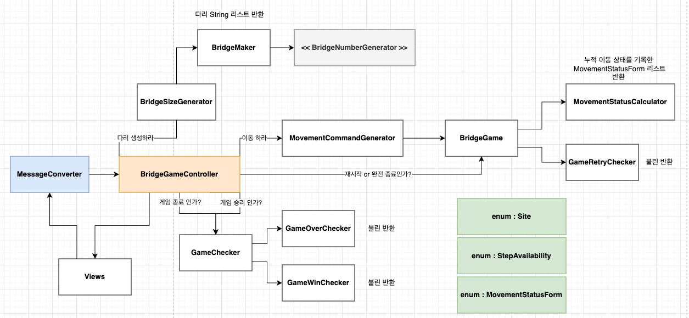

### 클래스 다이어그램


</br>

## **요구사항 재구성**

한 칸이 위 아래 칸으로으로 이루어진 다리를 왼쪽에서 출발해 오른쪽으로 건너야 한다

오징어 게임처럼 각 칸의 위 아래 둘중 하나는 건널수 없는 칸이다

사용자는 다음칸의 위 아래중 어디를 딛을지 선택한다

칸을 건널때마다 사용자가 딛은 칸에 상태를 화면에 O,X 로 표시한다

불가한 칸을 딛으면 게임 종료(실패)

완전히 다리를 건너면 게임 종료이다(성공)

게임 실패로 인한 종료 마다 재시작 혹은 완전 종료를 선택한다
  - 성공 시 선택 없이 완전 종료된다 
  - 재시작시 이전에 사용하던 다리를 그대로 사용한다

</br>

## **기능목록**

- [ ] 다리를 생성하는 기능
  - [ ]  다리 길이를 입력받는 기능
      - 예외 처리) 다리 길이는 3-20 이다
  - [ ]  길이 만큼 다리를 생성하는 기능
      - 0 : 아래 칸, 1 : 위 칸이 건널 수 있는 칸
      - 생성된 다리는 U : 위 , D : 아래로 표현된다  ex)  0110 → DUUD

- [ ] 플레이어 이동 상태를 생성하는 기능
  - [ ]  이동할 다음 칸 위치를 입력받는 기능
      - 예외 처리) U: 위 , D: 아래 의 입력만 허용한다
  - [ ]  위 입력과 다리를 비교해서 상태를 생성하는 기능
      - 게임 중에는 누적 기록 된다
      - 게임 시작 시 초기화 되어야 한다

- [ ]  플레이어 이동상태로 종료조건을 판별하는 기능
    - 못 건너는 칸을 딛으면 게임 종료
    - 완전히 건넜으면 게임 종료

- [ ]  게임 성공 여부를 확인하는 기능

- [ ]  플레이어 이동 상태를 화면에 출력하는 기능
      - 이동할 수 있는 칸을 선택한 경우 O 표시
      - 이동할 수 없는 칸을 선택한 경우 X 표시
      - 선택하지 않은 칸은 공백 한 칸으로 표시
      - 다리의 시작은 `[`, 다리의 끝은 `]`으로 표시
      - 다리 칸의 구분은 `|`(앞뒤 공백 포함) 문자열로 구분
      - 현재까지 건넌 다리를 모두 출력

- [ ]  게임 종료시 재시작 혹은 완전 종료를 선택받는 기능
    - 예외 처리) R: 재시작과 Q: 완전종료 의 입력만 허용한다
    - 예외 처리) 완전히 건넌(성공)경우 선택권 없이 자동으로 게임이 완전 종료된다
    - 재시작시 이전 다리 정보를 그대로 사용한다

- [ ]  완전 종료시 최종 결과를 출력하는 기능
    - 최종 플레이어 이동 상태를 출력
    - 게임 성공 여부 출력
    - 총 시도 횟수 출력

</br>

## **주의 사항 체크리스트**

- *실행 예시에 있는 출력 사이 개행 조건을 만족시켜야 한다
- 달리 명시하지 않는 한 파일, 패키지 이름을 수정하거나 이동하지 않는다.
- 예외 상황 시 IllegalArgumentException을 발생, 에러 문구를 출력해야 한다. 단, 에러 문구는 "[ERROR]"로 시작해야 한다
  - (단, `IllegalArgumentException`, `IOException` 등과 같은 명확한 유형을 처리한다.)
  - *에러가 발생한 부분 부터 이어서 다시 입력을 받는다
- 함수(또는 메서드)의 길이가 10라인
- 파라미터 개수는 최대 3개
- final 키워드로 값의 변경을 막는다
- 연관된 상수는 final static 대신 Enum을 사용한다
- `InputView`: 수정가능 (패키지 이동 가능)
  - `InputView` 클래스에서만 사용자 입력 가능
- `OutputView`: 메서드 이름 빼고 변경가능 (패키지 이동 가능)
- `BridgeGame`: 메서드 이름 빼고 변경 가능 (패키지 이동 가능)
- `BridgeMaker`: 필드 변수 추가 불가, 메서드 시그니처 수정 불가
- `BridgeGame` 클래스에서 `InputView`, `OutputView` 를 사용하지 않는다.
- 사용자가 입력하는 값은 `camp.nextstep.edu.missionutils.Console` 의 `readLine()`을 활용한다.

</br>

## **실행 예시**

```
다리 건너기 게임을 시작합니다.

다리의 길이를 입력해주세요.
3

이동할 칸을 선택해주세요. (위: U, 아래: D)
U
[ O ]
[   ]

이동할 칸을 선택해주세요. (위: U, 아래: D)
U
[ O | X ]
[   |   ]

게임을 다시 시도할지 여부를 입력해주세요. (재시도: R, 종료: Q)
R
이동할 칸을 선택해주세요. (위: U, 아래: D)
U
[ O ]
[   ]

이동할 칸을 선택해주세요. (위: U, 아래: D)
D
[ O |   ]
[   | O ]

이동할 칸을 선택해주세요. (위: U, 아래: D)
D
[ O |   |   ]
[   | O | O ]

최종 게임 결과
[ O |   |   ]
[   | O | O ]

게임 성공 여부: 성공
총 시도한 횟수: 2
```

</br>

### 구현 순서도 리스트

1. 명세서 완성
2. 메인 플로우(Controller)를 짜고 실행 예제를 대입해 검증한다
3. 메인 플로우에 사용되는 각 기능 목록을 순차적으로 구현(구현, 테스트, 리펙토링)한다
4. 기능 단위로 커밋
5. 커밋 단위로 명세에 반영한다